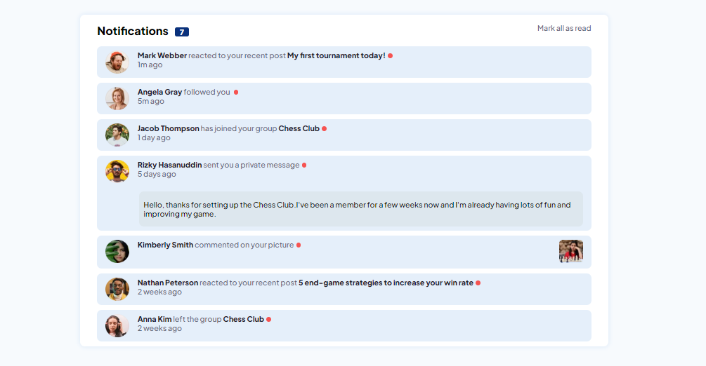
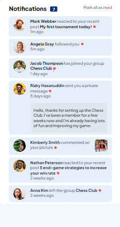

# Frontend Mentor - Notifications Page Main

This is a solution to the [Notifications Page Main challenge on Frontend Mentor](https://www.frontendmentor.io/challenges/notifications-page-DqK5QAmKbC). Frontend Mentor challenges help you improve your coding skills by building realistic projects. 

## Table of contents

- [Overview](#overview)
  - [The challenge](#the-challenge)
  - [Screenshot](#screenshot)
  - [Links](#links)
- [My process](#my-process)
  - [Built with](#built-with)
  - [What I learned](#what-i-learned)
  - [Continued development](#continued-development)
- [Author](#author)
- [Acknowledgments](#acknowledgments)

## Overview

It was a very interesting and somewhat complex challenge in my knowledge, involving JavaScript.

### The challenge

The focus was on arrays and element counts.

### Screenshot

# Desktop

# Mobile

### Links

- Live Site URL: [ => My Github <=](https://ericrdgs.github.io/Notifications-Page-Main/)

## My process

In HTML and CSS I had no problem, but in JavaScript I had a little problem, mainly in making notifications decrement when the user clicked on links and profiles.

### Built with

- Semantic HTML5 markup
- CSS custom properties
- Flexbox
- JavaScript

### What I learned

I learned more about arrays.

### Continued development

I want to evolve more in JavaScript, focusing on arrays.

## Author

- Website - [My Github](https://github.com/EricRDGS)
- Frontend Mentor - [@EricRDGS](https://www.frontendmentor.io/profile/EricRDGS)

## Acknowledgments

I was only able to solve this challenge thanks to the double dev, through their course, the DevQuest course.

